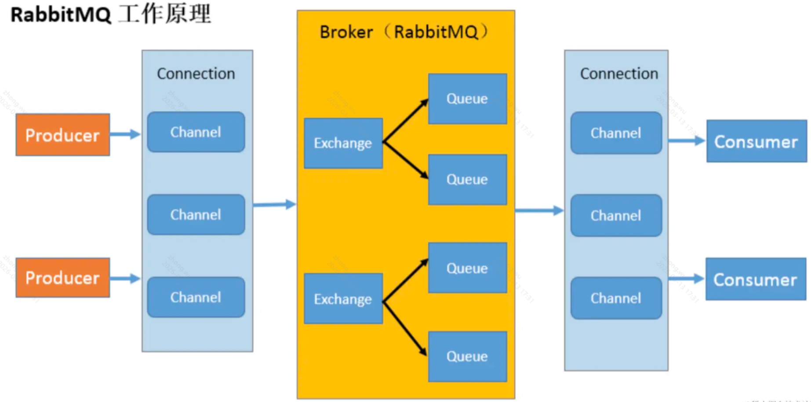

# RabbitMQ

Producer 和 Consumer 分别是生产者和消费者。
Connection 是连接，但我们不会每用一次 rabbitmq 就创建一个单独的 Connection，而是在一个 Connection 里做一下划分，叫做 Channel，每个 Channel 做自己的事情。
而 Queue 就是两端存取消息的地方了。
整个接收消息和转发消息的服务就叫做 **Broker**。
至于 Exchange，我们前面的例子没有用到，这个是把消息放到不同的队列里用的，叫做**交换机**。

Exchange 主要有 4 种：

- fanout：把消息放到这个交换机的所有 Queue，广播模式
- direct：把消息放到交换机的指定 key 的队列
- topic：把消息放到交换机的指定 key 的队列，支持模糊匹配
- headers：把消息放到交换机的满足某些 header 的队列

**流量削峰**
使用消息队列，比如常用的 RabbitMQ，MQ 的并发量比数据库高很多，第一个 web 服务接收请求，把消息存入 RabbitMQ，然后另一个 web 服务从 MQ 中取出消息存入数据库。
而数据库的并发比较低，我们可以通过 MQ 把消费的上限调低，就能保证数据库服务不崩。比如 10w 的消息进来，每次只从中取出 1000 来消费

- **流量削峰**：可以把很大的流量放到 mq 种按照一定的流量上限来慢慢消费，这样虽然慢一点，但不至于崩溃。
- **应用解耦**：应用之间不再直接依赖，就算某个应用挂掉了，也可以再恢复后继续从 mq 中消费消息。并不会一个应用挂掉了，它关联的应用也挂掉。
