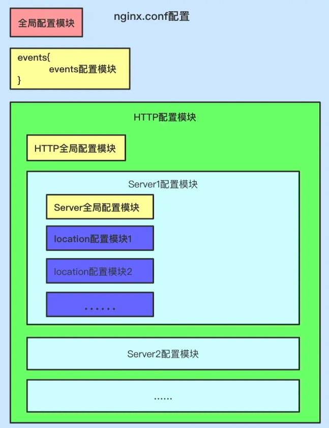

# nginx

> 常用语前端静态资源服务部署

## 常用命令

- 启动Nginx `start nginx`
- 停止Nginx `nginx.exe -s quit`
- 重启Nginx `nginx.exe -s reload`
- 检查Nginx配置是否正确 `nginx -t`

## 配置

1、全局块	与Nginx运行相关的全局设置
2、events块	与网络连接有关的设置
3、http块	代理、缓存、日志、虚拟主机等的配置
4、server块	虚拟主机的参数设置（一个http块可包含多个server块）
5、location块	定义请求路由及页面处理方式



### 内置变量

- $args请求行中的参数，同$query_string
- $content_length请求头中的Content-length字段
- $content_type请求头中的Content-Type字段
- $document_root当前请求在root指令中指定的值
- $host请求行的主机名，或请求头字段 Host 中的主机名
- $http_user_agent客户端agent信息
- $http_cookie客户端cookie信息
- $limit_rate可以限制连接速率的变量
- $request_method客户端请求的动作，如GET或POST
- $remote_addr客户端的IP地址
- $remote_port客户端的端口
- $remote_user已经经过Auth Basic Module验证的用户名
- $request_filename当前请求的文件路径
- $schemeHTTP方法（如http，https）
- $server_protocol请求使用的协议，如HTTP/1.0或HTTP/1.1
- $server_addr服务器地址
- $server_name服务器名称
- $server_port请求到达服务器的端口号
- $request_uri包含请求参数的原始URI
- $uri不带请求参数的当前URI
- $document_uri与$uri相同

### server

是在服务器上创建一个虚拟主机

> 虚拟主机是指在一台物理主机服务器上划分出多个磁盘空间，每个磁盘空间都是一个虚拟主机，每台虚拟主机都可以对外提供Web服务，并且互不干扰。在外界看来，虚拟主机就是一台独立的服务器主机，这意味着用户能够利用虚拟主机把多个不同域名的网站部署在同一台服务器上，而不必为一个网站单独购买一台服务器，既解决了维护服务器技术的难题，同时又极大地节省了服务器硬件成本和相关的维护费用

Nginx默认在 `conf/nginx.conf` 文件中配置了一个server块, http块中可以包含多个server块

```js
http{
  server{
    listen 80;
    server_name  localhost;
  }
}
```

### include

指令在http块中的应用

再利用 include 指令把 `conf/vhost` 文件夹中每个服务配置文件中的server块添加到`conf/nginx.conf` 文件中的http块中。
于是在 `conf/nginx.conf` 文件中的http块中添加如下配置：

```bash
http{
  //...
  include vhost/*.conf;
  server_names_hash_bucket_size 64;
}
```

其中 `vhost/*.conf` 表示 vhost 文件下的所有以 `.conf` 结尾的文件。`server_names_hash_bucket_size` 是 server_name 的存储大小。

### location

匹配用户访问服务所用的url的路径部分，匹配成功即进行相关的操作

语法是`location [=|~|~*|^~|@] pattern { ... }`，其中`[=|~|~*|^~|@]`是修饰符，`pattern`是匹配规则，在`{ ... }`中配置相关的操作。

`=`对应的匹配规则是个字符串，表示对url的路径进行精确匹配，即该字符串等于url的路径部分。
`~`对应的匹配规则是个正则，表示匹配时区分大小写。
`~*`对应的匹配规则是个正则，表示匹配时不区分大小写。
`^~`对应的匹配规则是个字符串，表示匹配时要检测url的路径中是否含有该字符串。
`@`用于定义一个location块，且该块不能被外部访问，只能被Nginx内部指令所访问。

优先级：`[=]` > `[^~]` > `[~/~*]` > 无修饰符

```js
server{
  listen 8081;
  server_name  test.com;
  location ^~ /doc {
    return 001;
  }
  location ^~ /docu {
    return 002;
  }
}
```

其中 ^~ /doc 和 ^~ /docu 都能匹配 url 路径 /document 。因为 /docu 字符串的长度比 /doc 长，所以匹配规则为 ^~ /docu 的location块被匹配上。

### root & alias

在location块中的区别

用 root 指令和 alias 指令是用来指定通过url访问服务器（指用server块创建的虚拟服务器，为了行文方便将其简称为服务器）的根目录路径的结果是不一致的.

```js
server{
  listen 8081;
  server_name  test.com;
  location ^~ /doc {
    root   html;
    // alias html
  }
}
```

通过 `root` 指定服务器的根目录路径，**会把location块的匹配规则 /doc 给拼接上**，此时服务器的根目录路径为 html/doc
通过 alias 指定服务器的的根目录路径，**不会去拼接location块的匹配规则**，alias 后面配置的路径就是服务器的根目录路径。

### index

指定当访问服务器的url路径后面没指定访问文件时默认访问的文件, 默认是index.html。

- index指令可以配置多个文件，用空格隔开。
- 文件可以用文件的相对路径或绝对路径来配置，若是绝对路径要放在最后配置。
- 如果配置多个文件，Nginx会根据文件的配置顺序从前往后来查找，直到查找到真实存在的文件。
- 要注意文件的相对路径是相对于所在 location块中配置的服务器根目录路径。

```js
server{
  listen 8081;
  server_name  test.com;
  location / {
    root   dist;
    index a/a.html;
  }
  location ^~ /b {
    root   dist;
    index b.html;
  }
}
```

### try_files

> 尝试查找文件

其语法是`try_files file ... uri;`， 其中 file 是文件的相对路径，可以配置多个，uri 是url路径 **要注意文件的相对路径是相对于所在location块中配置的服务器根目录路径**

Nginx会根据文件路径配置的顺序从前往后来查找，并使用第一个找到的文件的配置路径进行请求处理，如果通过配置的文件路径都没有找到对应的文件，则把最后一个配置的 uri 去匹配对应的location块。

```js
location / {
  try_files $uri $uri/ /index.html;
}
```

其中 `$uri` 是 url 的路径及文件名，例如访问 `http://test.com:8080/doc`，$uri 就是 /doc。

`$uri/` 会去访问路径下的默认访问文件。例如 doc 文件夹下有 index.html 文件，访问 `http://test.com:8080/doc` 时，可以通过 `$uri/` 访问 `doc/index.html` 文件 。

假设一个工程编译打包后只有一个入口文件 index.html, 那么 `try_files $uri $uri/ /index.html;` 的作用就是用任何 url 访问工程中的页面，最终都会访问到入口文件 index.html，这样当访问工程中的页面不存在时，会访问工程中的`404`页面，而不会访问浏览器自带的`404`页面。

### proxy_pass

> 代理有正向代理和反向代理两种，都是用proxy_pass指令来实现

正向代理: 的对象是用户，用户知道访问那个服务器，而服务器不知道是那个用户访问它。
反向代理: 的对象是服务器，用户不知道访问了那个服务器，而服务器知道那个用户访问它。

```js
server{
  listen 8080;
  server_name  test.com;
  location ^~ /doc {
    // 反向代理
    proxy_pass: http://127.0.0.1:8001/
    proxy_set_header Host $host;
    proxy_set_header X-Real-IP $remote_addr;
    proxy_set_header X-Forwarded-For $proxy_add_x_forwarded_for;
  }
}
```

proxy_pass：定义后端服务器的地址。
proxy_set_header：修改从客户端传递到代理服务器的请求头。
proxy_hide_header：隐藏从代理服务器返回的响应头。
proxy_redirect：修改从代理服务器返回的响应头中的Location和Refresh头字段。

### rewrite

> 重定向。其语法是 `rewrite regex replacement [flag];`。

- `regex` 是匹配url路径的正则表达式；

- `replacement` 是重定向的地址，要注意在location块中使用且值为文件路径时，如果location块中未定义服务器根目录路径，则是将Nginx安装目录中 html 文件夹的路径作为参照路径，如果有定义服务器根目录路径，就以服务器根目录路径为参照路径；

- `flag` 是标志位，在location块中一般使用 break，表示执行完rewrite，不会继续匹配其它location块。如果使用 last，表示执行完rewrite，会继续匹配其它location块。

## 部署方案

> eg: 子域名路径`/bbb/`

准备工作：

- web 打包配置需要更改 `publicPath: process.env.NODE_ENV == 'development' ? '/' : '/bbb/'`
- 路由更改：

```js
const router = new Router({
  //...
  base: process.env.BASE_URL,
});
```

- 创建nginx配置文件

### 反向代理部署

反向代理也叫reverse proxy，指的是代理外网用户的请求到内部的指定web服务器，并将数据返回给用户的一种方式，这是用的比较多的一种方式, **正向代理代理客户端，反向代理代理服务器**

- 在 `conf/vhost` 文件夹下创建 `A.conf` 来写入A工程部署到域名XXX（ www.xxx.com ）根路径上的部署配置

```bash
# A.conf
server {
  listen 80;
  server_name xxx.com;
  location / {
    root /home/ec2-user/git_src/avue/dist;
    try_files $uri $uri/ /index.html;
    index index.html;
  }
  # 反向代理 10.203.19.74 为真实服务器ip地址。这样间接实现了在域名XXX（ www.xxx.com ）的子路径 /bbb/ 上部署了B工程
  location ^~ /bbb {
    proxy_pass http://10.203.19.74:8081/;
    proxy_hide_header Location;  # 若想隐藏多个head头部信息需要再次定义proxy_hide_header,不支持在后面接着写
  }
}
```

- 在 `conf/vhost` 文件夹下创建 `B.conf` 来写入B工程部署到端口为8081的服务上的部署配置

```js
server {
  listen 8001;
  location / {
    root /home/ec2-user/git_src/bvue/dist;
    try_files $uri $uri/ /index.html;
    index index.html;
  }
}
```

反向代理配置参数：

- `proxy_pass`: 用来设置将客户端请求转发给的后端服务器的主机，可以是主机名、IP地址：端口的方式，也可以代理到预先设置的主机群组
- `proxy_hide_header`; 用于nginx作为反向代理的时候，在返回给客户端http响应的时候，隐藏后端服务版本相应头部的信息，可以设置在`http/server`或`location`块

### alias 配置部署

在 conf/vhost/A.conf 文件中写入所示的配置：

```bash
# A.conf
server {
  listen 80;
  server_name xxx.com;
  location / {
    root /home/ec2-user/git_src/avue/dist;
    try_files $uri $uri/ /index.html;
    index index.html;
  }

  # 如果location块的匹配规则是字符串且以 / 结尾，那么alias 指令的值最后一定要加 /，否则可加可不加
  # 这是因为匹配规则为 /bbb 的location块中 try_files 指令的最后一个参数引起的。按着前面对 try_files 指令的介绍，在 try_files 指令执行中没有找到匹配的文件后，会用 /index.html 去匹配其它location块。于是匹配到匹配规则为 / 的location 块，导致访问B工程中未定义的页面会访问到A工程中404页面。

  location ^~ /bbb {
    alias /home/ec2-user/git_src/bvue/dist;
    try_files $uri $uri/ /index.html;
    index index.html;
  }
  # 用修饰符 @ 创建一个内部的location块（@router），在这个location块中用 rewrite 指令来解决这个问题
  location @router {
    root /home/ec2-user/git_src/bvue/dist;
    rewrite ^.*$ /index.html break;
  }
}
```

要注意在location块中使用 rewrite 指令，要定义服务器根目录路径，不然重定向的相对路径会相对于Nginx的安装目录中的html文件夹路径。
且定义内部location块时只能用root指定服务器跟目录路径。
此外 rewrite 指令的标志位也要选择 break，不然执行完rewrite还会继续匹配其它location块，最终还是会匹配到规则为 / 的location块，导致访问B工程中未定义的页面会访问到A工程中404页面。

### root配置部署

在 conf/vhost/A.conf 文件中写入如下所示的配置

```bash
# A.conf
server {
  listen 80;
  server_name xxx.com;
  location / {
    root /home/ec2-user/git_src/avue/dist;
    try_files $uri $uri/ /index.html;
    index index.html;
  }
  location ^~ /bbb {
    root /home/ec2-user/git_src/bvue/;
    try_files $uri $uri/ @router;
    index index.html;
  }
  location @router {
    root /home/ec2-user/git_src/bvue/dist;
    rewrite ^.*$ /index.html break;
  }
}
```
