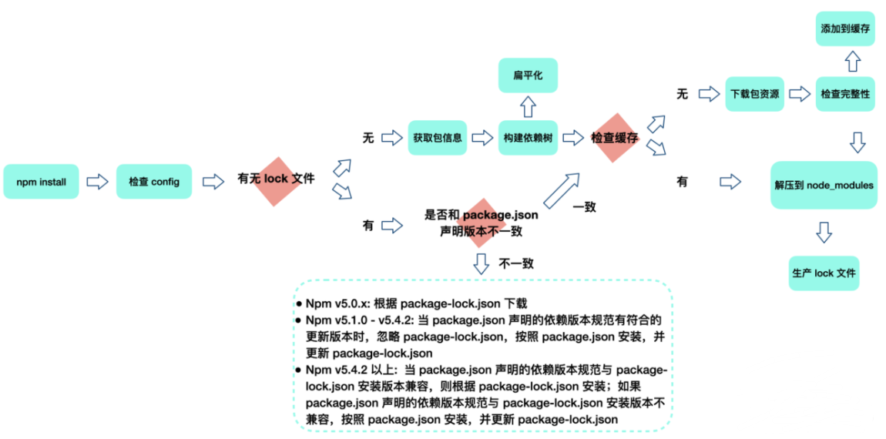

# npm

> 随着nodejs流行，npm伴随nodejs逐步成长起来，安装nodejs以后就自动安装了npm。

## npm是什么

npm 是 nodejs 的包管理和分发工具。它 可以让 javascript 开发者能够更加轻松的共享代码和共用代码片段，并且通过 npm 管理你分享的代码也很方便快捷和简单。

### npm 多源镜像和企业级部署私服原理

npm 中的源`registry`，其实就是一个查询服务

- 临时使用

```bash
npm --registry https://registry.npm.taobao.org install express
```

- 持久使用

```bash
npm config set registry https://registry.npm.taobao.org

# 配置后可通过下面方式来验证是否成功
npm config get registry
# 或
npm info express
```

**cnpm**配置

```bash
npm install -g cnpm --registry=https://registry.npm.taobao.org
```

- 使用 `nrm` 管理镜像源
- 私有源原理：在 client 和外部 npm 之间，并通过 group repository 合并 npm 仓库以及私有仓库，这样就起到了代理转发的作用。


### npm升级

```sh
  npm install npm -g
  // 查看当前版本
  npm -v 
```

## 安装方式（全局 or 局部）



- 检查并获取 npm 配置，这里的优先级为：项目级的 `.npmrc 文件 > 用户级的 .npmrc 文件> 全局级的 .npmrc 文件 > npm 内置的 .npmrc 文件`
- 检查 package-lock.json 与 package.json
- 检查本地化缓存，使用缓存

npm 提供了两种包的安装形式：**局部安装和全局安装**。你可以通过你的项目使用情况选择如何安装。如果你的项目依赖于某个包，那么建议将改包安装到局部。其他其他条件下，比如你要在命令行工具中使用这个包，可选择在全局安装。

- 全局安装示例：

```sh
npm install package -g
```

一般这样安装都是以工具，命令行形存在

- 局部安装示例：

**dependencies**:

```sh
npm install package --save
```

**devDependencies**:

```sh
npm install package --save-dev
```

这是两种局部包安装

>一个node package常用有两种依赖，一种是dependencies一种是devDependencies，其中前者依赖的项该是正常运行该包时所需要的依赖项，而后者则是开发的时候需要的依赖项。

上面说有2种的形式很官方，简单说一下区别，dependencies是开发和生产运行需要的包依赖，例如前端jqeury， angular，lodash，Bootstrap等这样的开发需要的库和框架，devDependencies是一些开发辅助包，例如前端的webpack，gulp，bower，等这样的工具。

- --save是自动帮你安装包添加依赖关系到 package.json的dependencies下
- --save-dev是自动帮你安装包添加依赖关系到 package.json的devDependencies下

除了上面2个比较常用的外，还可以简写：

简写命令说明

- `-S --save` 添加依赖关系到dependencies下
- `-D --save-dev` 添加依赖关系到devDependencies下
- `-O --save-optional` 添加依赖关系到optionalDependencies下

- `optionalDependencies` 一般用的不多, 可选的依赖
- `peerDependencies` 同版本依赖，规范安装库需要对应版本依赖
- `bundledDependencies` 捆绑依赖，bundledDependencies 中指定的依赖包，必须先在 dependencies 和 devDependencies 声明过，否则在 `npm pack` 阶段会进行报错。

### CI下安装

专门为 CI 环境准备的安装命令

```bash
npm ci
```

- `npm ci` 要求项目中必须存在 `package-lock.json` 或 `npm-shrinkwrap.json`；
- `npm ci` 完全根据 `package-lock.json` 安装依赖，这可以保证整个开发团队都使用版本完全一致的依赖；
- 正因为 `npm ci` 完全根据 `package-lock.json` 安装依赖，在安装过程中，它不需要计算求解依赖满足问题、构造依赖树，因此安装过程会更加迅速；
- `npm ci` 在执行安装时，会先删除项目中现有的 `node_modules`，然后全新安装；
- `npm ci` 只能一次安装整个项目所有依赖包，无法安装单个依赖包；
- 如果 `package-lock.json` 和 `package.json` 冲突，那么 `npm ci` 会直接报错，并非更新 `lockfiles`；
- `npm ci` 永远不会改变 `package.json` 和 `package-lock.json`。

### 几种安装形式和卸载

- 普通安装

```sh
  npm install jquery --save
```

- 指定安装最后一个版本

```sh
  npm install jquery@latest --save
```

- 指定安装@2.1.1版本

```sh
  npm install jquery@2.1.1 --save
```

- 指定安装大于等于@2.0.0小于2.2.0版本

```sh
  npm install jquery@">=2.0.0 <2.2.0" --save
```

### 安装github包

>因为有些包没有添加到npm里面，但在github上面，我们可以使用以下方式来安装

- 指定安装某个版本

```sh
npm install git+ssh://git@github.com:npm/npm.git#v1.0.27
```

- 直接安装

```sh
npm install git+https://isaacs@github.com/npm/npm.git
```

- 指定安装某个版本

```sh
npm install git://github.com/npm/npm.git#v1.0.27
```

### 删除安装包

- 删除全局包

```sh
npm uninstall -g @angular/cli
```

- 删除局部包

```sh
npm uninstall jquery
```

> 怎么安装就怎么删除，不用跟版本号。

## npm初始化

上面说了怎么安装删除，现在说一个npm管理依赖的文件package.json。

创建一个文件夹，在当前文件夹里打开命令行，输入npm init
然后就会出现以下一些提示要你填写：
name：填写包的名字，默认是你这个文件夹的名字。

>如果你这个东西将来要做成一个npm包发布（后面说怎么发布一个npm包），就需要注意了。你需要去npm上找一下，有没有同名的包，npm search 包名，如果没有，恭喜你可以注册。如果存在，那你只能自己改名了。没办法，先到先得。

- version：包的版本，默认是1.0.0
- description：用一句话描述你的包是干嘛用的，随便写点啥也可以不写直接回车了
- entry point：入口文件，默认是index.js，就是引入这个包就可以运行的。

- index.js: 需要些一行这个代码`module.exports=require('./lib')`  这个就是你需要用包地址

- `test command`：测试命令。一般都用不上跳过了
- `git repository`：这个是git仓库地址，如果你的包是先放到github上或者其他git仓库里，这时候你的文件夹里面会存在一个隐藏的.git目录，npm会读到这个目录作为这一项的默认值。如果没有的话，直接回车继续。
-`keyword`：这个是一个重点，这个关系到有多少人会搜到你的npm包。尽量使用贴切的关键字作为这个包的索引。里面是一个字符串数组
- `author`：作者
- `license`：开源协议

然后它就会问你Are you ok?
回车就好了。
然后你当前文件都会生成一个package.json文件。
然后我们就可以安装依赖了，参照上面npm依赖安装

### engines：依赖node和npm版本

```json
"engines": {
    "node": ">= 6.9.0",
    "npm": ">= 3.0.0"
  }
```

> 如果小于这个版本就好抛错。做开源的东西，尽量加上这个，node更新很快，每个版本功能都有些差异。

### scripts：npm运行命令

```json
"scripts": {
    test： “echo \”Error: no test specified\" && exit 1"
}
```

我们可以在命令行运行`npm run test`
接着就会输出`Error: no test specified`

`webpack`都是使用npm来管理命令行，然后运行`npm run xxx`

## 创建用户

```bash
npm adduser

# username, 用户名，最好就是邮箱前缀，比如 san.zhang
# password
# email, 邮箱，最好填写公司邮箱，比如 san.zhang@100credit.com

# 查看模块 owner
$ cnpm owner ls demo

# 添加一个发布者
$ cnpm owner add xxx demo

# 删除一个发布者
$ cnpm owner rm xxx demo
```

## 发布npm

- 注册账号
- 先需要去npm注册

> 在搜索框右边sign up or log in

### npm验证

- 打开命令行npm login
- 输入你的username 回车
- 输入你的password 这个看不到输入 输完就回车
- 输入你的email
以上信息都是你注册填写的。

### npm发布

在你要发布的项目文件夹里面打开命令输入`npm publish`

>如果版本未修改发布会报错，你需要去修改一下version。每次修改都需要npm publish，记得修改version

### npm包删除

>有发布就有删除，删除好像有个限制，如果大于24小时，需要联系npm管理员删除。

```sh
npm unpublish 包名 --force
```

## npm其他常用命名

```sh
npm install 安装模块
npm uninstall 卸载模块
npm update 更新模块
npm outdated 检查模块是否已经过时
npm ls 查看安装的模块
npm init 在项目中引导创建一个package.json文件
npm help 查看某条命令的详细帮助
npm root 查看包的安装路径
npm config 管理npm的配置路径
npm cache 管理模块的缓存
npm start 启动模块
npm stop 停止模块
npm restart 重新启动模块
npm test 测试模块
npm version 查看模块版本
npm view 查看模块的注册信息
npm adduser  用户登录
npm publish 发布模块
npm access 在发布的包上设置访问级别
npm config get cache 查看npm缓存
# 清除缓存
npm cache clean

# 升级补丁版本号
$ npm version patch

# 升级小版本号
$ npm version minor

# 升级大版本号
$ npm version major


# 管理你的模块（查看安装的模块）
npm list
# 该命令会显示所有模块：(安装的)模块，子模块以及子模块的子模块等。可以限制输出的模块层级：
npm list --depth=0
# 该命令会为模块在全局目录下创建一个符号链接。可以通过下面的命令查看模块引用：
npm list -g --depth=0
```

## 依赖版本解释

### ~和^的作用和区别是什么

一般版本是1.0.0（大.中.小）
会匹配最近的小版本依赖包，比如1.2.3会匹配所有1.2.x版本，但是不包括1.3.0
^会匹配最新的中版本依赖包，比如^1.2.3会匹配所有1.x.x的包，包括1.3.0，但是不包括2.0.0

### 其他版本号

“jquery”： “2.0.1” 等于当前版本
“jquery”： “>=1.0.2 <2.1.2” 大于等于version 小于version
“jquery”： “>1.0.2 <=2.3.4” 大于version 小于等于version
“jquery”： “<2.3.4” 小于version
“jquery”： “<=2.3.4” 小于等于version
“jquery”： “>2.3.4” 大于version
“jquery”： “>=2.3.4” 大于等于version
“jquery”： “<1.0.0 || >=2.3.1 <2.4.5 || >=2.5.2 <3.0.0” 三选一version
“jquery”： “~2.3.4” ~1.2.3会匹配所有1.2.x版本，但是不包括1.3.0
“jquery”： “^2.3.4” ^1.2.3会匹配所有1.x.x的包，包括1.3.0，但是不包括2.0.0

常用就这些，一般就用~和^或者直接写版本

> 以上就是npm常用一些小知识。

## 本地包调试

```bash
# 模块包
npm link
npm unlink

# 项目
npm link package
npm unlink package
```

- 为目标 npm 模块创建软链接，将其链接到全局 node 模块安装路径 /usr/local/lib/node_modules/
- 为目标 npm 模块的可执行 bin 文件创建软链接，将其链接到全局 node 命令安装路径 /usr/local/bin/。

## npx

npx 由 npm v5.2 版本引入，解决了 npm 的一些使用快速开发、调试，以及项目内使用全局模块的痛点。

- 可以直接省去script命令，去执行一些命令

```bash
# 例：npm run eslint 
npx eslint --init

npx eslint yourfile.js

```

- npx 执行模块时会优先安装依赖，但是在安装执行后便删除此依赖，这就避免了全局安装模块带来的问题。

```bash
# npx 会将 create-react-app 下载到一个临时目录，使用以后再删除
npx create-react-app cra-project
```

## 参考

- [告诉你为何以及如何搭建一个私有的npm仓库](https://zhuanlan.zhihu.com/p/35773211)
- [npm 和 yarn 缓存策略对比](https://segmentfault.com/a/1190000009709213)
- [Yarn 介绍](http://qianduan.guru/2016/11/09/yarn-vs-npm/)
- [npm 发布](https://cnodejs.org/topic/5364dcde31a870830700b847)
- [Babel 入门教程](http://www.ruanyifeng.com/blog/2016/01/babel.html)
- [如何发布node模块到npm社区](https://github.com/muwenzi/Program-Blog/issues/12)
- [nvm](https://www.hi-linux.com/posts/51355.html)
- [nvm、nrm、npm 安装和使用详解](https://blog.csdn.net/qq_27626333/article/details/77857223)
