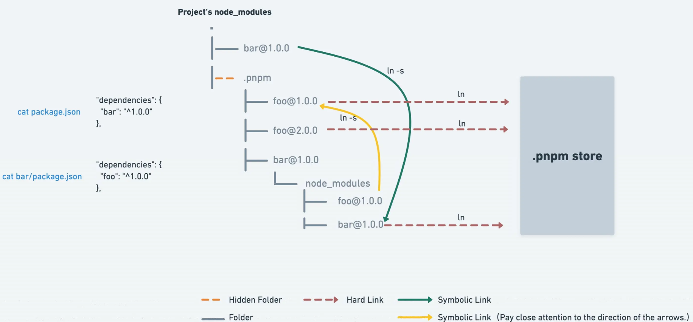

# pnpm

[pnpm 文档](https://www.pnpm.cn/)



## 简介

### hard link 机制

- hard link 使得用户可以通过不同的路径引用方式去找到某个文件。
- pnpm 会在全局的 store 目录里存储项目 node_modules 文件的 hard links 。

### Store 目录

- store 目录默认是设置在 ${os.homedir}/.pnpm-store 这个目录下
- 项目上可以在 .npmrc 设置这个 store 目录位置

### node_modules

- pnpm 的 node_modules 结构是个网状 + 平铺的目录结构。这种依赖结构主要基于软连接(即 symlink)的方式来完成。
- .pnmp为虚拟存储目录，该目录通过`<package-name>@<version>`来实现相同模块不同版本之间隔离和复用，由于它只会根据项目中的依赖生成，并不存在提升，所以它不会存在之前提到的Phantom dependencies问题！

## monorepo

### 建立 workspace

- 根目录配置文件[pnpm-workspace.yaml](https://www.pnpm.cn/pnpm-workspace_yaml)

```bash
packages:
  # all packages in subdirs of packages/ and components/
  - 'packages/**'
  # exclude packages that are inside test directories
  - '!**/test/**'
```

### 安装依赖

- 公共依赖提升
- 特定包依赖

```bash
# 全局安装
pnpm add -w xx
pnpm add -D -w xxx

# 指定包安装
pnpm add -D xx --filter packageName
```

### 设定命令

```json
{
  "script": {
    "dev:app1": "pnpm -C ./packages/app1 dev",
    "dev:app2": "pnpm dev --filter \"@xx/app2\"",
  }
}
```

### 包相互依赖

- [pnpm workspace](https://www.pnpm.cn/workspaces)

```json
// packages/app1/package.json 增加
{
  "dependencies": {
    "@mono/app2": "workspace:^1.0.0"
  }
}

// 根目录
pnpm i
```
