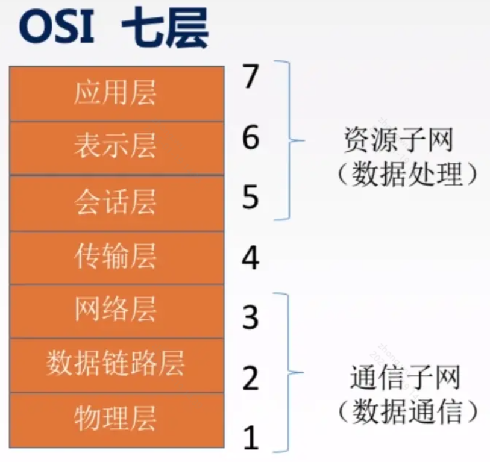

## 服务端相关知识

## 计算机机器（虚拟机器）相关概念

> 💻 介绍一些机器（虚拟）相关

### 服务器

是作为实体的硬件存在的，一般的服务器都是部署在专有的机房之中，服务器的组成一般与个人用PC机相同，只不过侧重点不同，个人PC机更侧重于娱乐和个人应用，而服务器更加倾向于性能、安全、散热、稳定等指标
一般服务器上会安装诸如linux或者winserver（windows的服务器版本）等系统，并在服务器上安装相应功能的软件，提供不同的服务，比如搭建网站需要
**安装数据库、http服务**等等，划分空间进行存储，http网站服务等。

### 虚拟主机

顾名思义，由于实体服务器需要更高的成本，比如硬件费用，机房租用费用，以及人员维护成本等。为了更好的推广互联网，大的互联网公司推出了虚拟主机的服务，也就是说你不需要硬件、带宽、运维等就可以使用服务器的资源搭建自己的服务，当然低成本的同时性能也会相应的降低。因为一般的虚拟主机都是
**同一台服务器上虚拟出来的系统**以供人们使用，动态修改参数配置。

### 其他

- CPU：**处理器**，类似商店里的营业员，单核一个人，双核2个人，四核4个人

- 显卡：处理图像，类似商店外边的女模特，脸蛋好，长的越精致越贵。**信号转换显示图形**，**独立显卡**个性化设计，娱乐，绘图等

- 内存：类似店铺营业间，越大摆放的商品越多。**暂存区**

- 硬盘：类似店铺的：**仓库**，越大，摆放的越多。**固态硬盘**

**硬盘和内存的区别**，内存是商品展示（数据从硬盘搬到内存暂存），CPU（类似营业员）将内存的数据进行处理，如果缺数据了，就从硬盘搬到内存，顺手将内存暂时不用的数据搬回硬盘（仓库）。在硬盘（仓库）一个区域划出一块地方，用于暂时保存数据（暂时不用或即将要用的），这个区域就叫虚拟内存。

- 速率：数据传输（数据是指0和1）的速率，比如你用迅雷下载，1兆每秒，来衡量目前数据传输的快慢

- 带宽：网络带宽是指在单位时间（一般指的是1秒钟）内能传输的数据量，比如说你家的电信网络是100兆比特，意思是，一秒内最大的传输速率是100兆比特。

- 吞吐量：表示在单位时间内通过某个网络（或信道、接口）的数据量。

- 时延：时延是指数据（报文/分组/比特流）从网络（或链路）的一端传送到另一端所需的时间，单位是s：发送、传播、排队、处理、往返

## OSI层

1、物理层

物理层更多的**是规定传输媒体接口的标准**，他并不管物理介质具体是什么，比如电线杆上是光纤还是双绞线，只要你能按物理层规定的标准传输数据就行。

- 计算机传输数据需要先把电信号转为光信号，然后光信号快到服务器的时候，再把光信号转为电信号。
- 线路上传输的信号功率会逐渐衰减，衰减到一定程度时将造成信号失真，因此会导致接收错误
- 中继器可以对信号进行再生和还原，增加信号的传输距离

2、数据链路层

主要功能：

- 封装成帧：封装的网络数据包，在链路层就叫数据帧
- 透明传输：帧的数据部分可能有跟帧首部完全一样的字符，这时候就要采取一定的措施，让接受方不要被被误导，能让接收方知道哪些是帧的首部哪些是帧的数据
- 差错控制：差错控制的方法有CRC循环冗余码
- 差错纠正：丢失后，通过重新发送没有的文件来纠正
- 流量控制：比如说发送方发送速度特别快，接收方接收速度特别慢，会造成传输出错

3、以太网、无线网

以太网是一种局域网技术，其规定了访问控制方法、传输控制协议、网络拓扑结构、传输速率等，完成数据链路层和物理层的一些内容，它采用一种称作CSMA/CD的媒体接入方法（后面会介绍），另外的一些局域网技术，比如无线局域网等

- 无连接。发送方和接收方不建立连接。
- 不可靠。接收方不向发送方进行确认，差错帧直接丢弃。

无线局域网WLAN是利用无线电波、激光和红外线等无线通信技术来构建的局域网