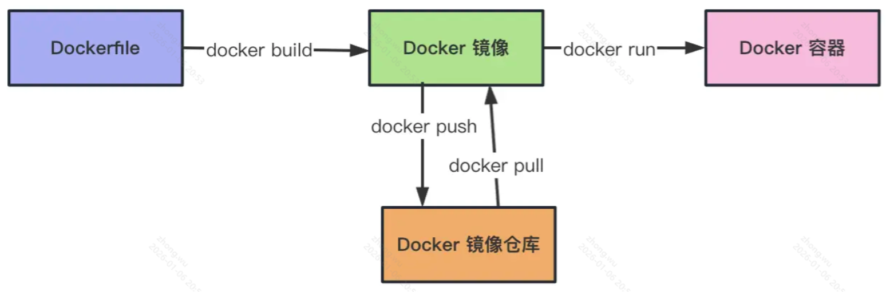

# Docker

基于Go语言开发的开源应用容器引擎，属于对Linux容器技术（LXC）的一种封装（利用了Linux的namespace和cgroup技术），它提供了简单易用的容器使用接口，是目前最流行的 Linux 容器解决方案。Docker将应用程序与该程序的依赖打包在一个文件里面，运行这个文件，就会生成一个虚拟容器。程序在这个虚拟容器里运行，就好像在真实的物理机上运行一样

1. 提供一次性的环境。
2. 提供弹性的云服务（利用Docker很容易实现扩容和收缩）
3. 实践微服务架构（隔离真实环境在容器中运行多个服务）

Docker 的实现原理依赖 linux 的 Namespace、Control Group、UnionFS 这三种机制。**Namespace 做资源隔离，Control Group 做容器的资源限制，UnionFS 做文件系统的分层镜像存储、镜像合并**

## 准备

[docker 官网](https://www.docker.com/)

## 构建镜像

- Docker镜像是由文件系统叠加而成的，系统的最底层是**bootfs**，相当于就是Linux内核的引导文件系统；
- 接下来第二层是**rootfs**，这一层可以是一种或多种操作系统（如Debian或Ubuntu文件系统），Docker中的rootfs是只读状态的；
- Docker利用联合挂载技术将各层文件系统叠加到一起，最终的文件系统会包含有底层的文件和目录，这样的文件系统就是一个镜像。



**Dockerfile**使用DSL（Domain Specific Language）来构建一个Docker镜像，只要编辑好了Dockerfile文件，就可以使用`docker build`命令来构建一个新的镜像。

Dockerfile文件示例：

```Dockerfile
# 指定基础镜像
FROM python:3.7
# 指定镜像的维护者
MAINTAINER jackfrued "jackfrued@126.com"
# 将指定文件添加到容器中指定的位置
ADD api/* /root/api/
# 设置工作目录
WORKDIR /root/api
# 把容器外的内容复制到容器内
COPY . .
# 执行命令(安装Flask项目的依赖项)
RUN pip install -r requirements.txt -i https://pypi.doubanio.com/simple/
# 容器启动时要执行的命令
ENTRYPOINT ["./start.sh"]
# 暴露端口
EXPOSE 8000
# 容器启动的时候执行的命令
CMD ["http-server", "-p", "8000"]
```

## docker compose

示例：

```yaml
services:
  nest-app:
    build:
      context: ./
      dockerfile: ./Dockerfile
      # 依赖镜像，先启动这两
    depends_on:
      - mysql-container
      - redis-container
    ports:
      - '3000:3000'
  mysql-container:
    image: mysql
    ports:
      - '3306:3306'
    volumes:
      - /Users/guang/mysql-data:/var/lib/mysql
    environment:
      MYSQL_DATABASE: aaa
      MYSQL_ROOT_PASSWORD: guang
  redis-container:
    image: redis
    ports:
      - '6379:6379'
    volumes:
      - /Users/guang/aaa:/data

```

通信方式：

- 通过端口访问， nest 的容器里通过宿主机 ip 访问这两个服务的
- 通过 docker network create 创建一个桥接网络，然后 docker run 的时候指定 --network，这样 3 个容器就可以通过容器名互相访问了。

## 重启

Docker 是支持自动重启的，可以在 docker run 的时候通过 --restart 指定重启策略，或者 Docker Compose 配置文件里配置 restart。

有 4 种重启策略：

- no: 容器退出不自动重启（默认值）
- always：容器退出总是自动重启，除非 docker stop。
- on-failure：容器非正常退出才自动重启，还可以指定重启次数，如 on-failure:5
- unless-stopped：容器退出总是自动重启，除非 docker stop

重启策略为 always 的容器在 Docker Deamon 重启的时候容器也会重启，而 unless-stopped 的不会。

其实我们用 PM2 也是主要用它进程崩溃的时候重启的功能，而在有了 Docker 之后，用它的必要性就不大了。

当然，进程重启的速度肯定是比容器重启的速度快一些的，如果只是 Docker 部署，可以结合 pm2-runtime 来做进程的重启。