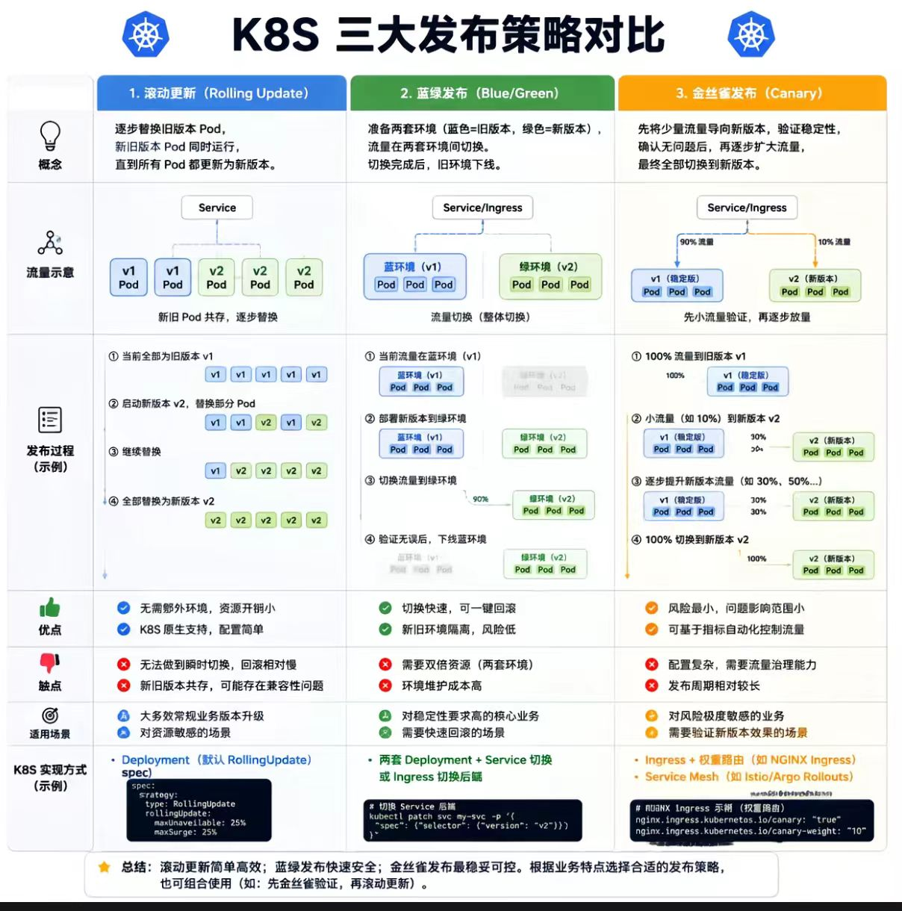

# 项目开发

## 前置知识

mysql 做关系型数据库、redis 做缓存和临时数据存储、minio 做 OSS 服务、docker 和 docker compose 做部署、typeorm 做 ORM 框架等

## 部署发布

### 上线部署策略对比表

| 部署策略 | 核心原理 | 前端典型实现方式 | 优点  | 缺点  | 适用场景 |
| --- | --- | --- | --- | --- | --- |
| **蓝绿发布** | 维护两套完全独立的环境（蓝/绿），通过切换流量入口瞬间完成版本切换。 | 1. 构建时给静态资源打上哈希（如 `app.8a9f3c.js`），新旧文件共存。 2. 部署时仅切换 `index.html` 的引用链接（从旧资源切到新资源）。 3. CDN或服务器上新旧资源同时在线，回滚只需切回旧 `index.html`。 | • 切换速度快（秒级） • 回滚几乎零成本 • 发布过程零停机 | • 资源占用翻倍（新旧资源同时存储） • 需保证CDN缓存策略配合（如 `index.html` 不缓存） | 绝大多数现代单页应用（SPA），对发布速度和回滚能力要求高的场景。 |
| **灰度发布（金丝雀）** | 新版本逐步放量，先让少量用户使用，验证稳定后再全量推送。 | 依赖**后端网关**（Nginx、Istio）或**CDN边缘脚本**，根据用户Cookie、IP、地域或自定义Header，按比例（如1%、5%）将不同用户路由到不同的 `index.html` 版本。 | • 风险可控，影响面小 • 可真实验证线上效果 • 支持A/B测试 | • 实现复杂，需要网关或边缘计算支持 • 发布周期较长 • 需监控和决策机制 | 大型系统、核心功能更新，或需要做A/B实验的场景。 |
| **滚动发布** | 分批逐步替换旧实例，每次只升级一部分服务器。 | 老旧项目（如JSP、PHP）或未使用哈希的静态文件，直接**覆盖**服务器上的同名字段，同时多台服务器分批重启或重载。 | • 资源利用率高（无需双倍资源） | • 新旧版本混合期间问题排查困难 • 回滚慢（需重新覆盖） • 浏览器缓存可能导致用户看到破碎页面 | 传统后端渲染的前端应用，或对资源成本极度敏感且可接受一定风险的内部系统。 |
| **大厂黄金组合** （蓝绿 + 灰度 + 特性开关） | 综合运用多种策略，实现极致的发布安全和灵活性。 | 1. **静态资源**采用蓝绿模式（哈希共存，`index.html`切换）。 2. **用户分流**由网关灰度控制（按比例或条件）。 3. **功能开关**（Feature Flag）嵌入代码，新功能上线后仍可由后台动态开关，无需重新发布。 | • 回滚最快（开关秒级关闭） • 流量控制最灵活 • 支持复杂发布策略（如内测用户先行） | • 基建成本高 • 技术栈要求全面（需要网关、配置中心、监控等） | 头部互联网公司、金融核心系统等对稳定性和灵活度要求最高的场景。 |

* * *

> **补充说明**：
> 
> -   **蓝绿发布**是前端静态资源层面的事实标准，因其哈希机制天然支持两套共存。
> -   **灰度发布**如果不借助网关，仅靠前端代码无法实现百分比分流（因为静态文件下发是广播式的）。
> -   **滚动发布**在现代前端工程中已很少作为主流方案，除非是遗留系统。
> -   **特性开关**可以与上述任意一种策略搭配，进一步降低发布风险。

## 登录信息验证

1、session + cookie

session + cookie 的给 http 添加状态的方案是服务端保存 session 数据，然后把 id 放入 cookie 返回，cookie 是自动携带的，每个请求可以通过 cookie 里的 id 查找到对应的 session，从而实现请求的标识。这种方案能实现需求，但是有 CSRF、分布式 session、跨域等问题，不过都是有解决方案的

2、jwt

token 的方案常用 json 格式来保存，叫做 json web token，简称 JWT。
JWT 是保存在 request header 里的一段字符串（比如用 header 名可以叫 authorization）

JWT 是由 header、payload、verify signature 三部分组成的：
header 部分保存当前的加密算法，payload 部分是具体存储的数据，verify signature 部分是把 header 和 payload 还有 salt 做一次加密之后生成的。（salt，盐，就是一段任意的字符串，增加随机性）
这三部分会分别做 Base64，然后连在一起就是 JWT 的 header，放到某个 header 比如 authorization 中

- JWT 要搭配 https 来用，让别人拿不到 header
- JWT 里也不要保存太多数据
- 可以配合 redis 来解决，记录下每个 token 对应的生效状态，每次先去 redis 查下 jwt 是否是可用的，这样就可以让 jwt 失效
- 双token无感续签：access_token 用于身份认证，refresh_token 用于刷新 token，也就是续签，在响应是 401 的时候，自动访问 refreshToken 接口拿到新 token，然后再次访问失败的接口。
- 单 token 续签的原理，就是登录后返回 jwt，每次请求接口带上这个 jwt，然后每次访问接口快过期则header返回新的 jwt，然后前端更新下本地的 jwt token。