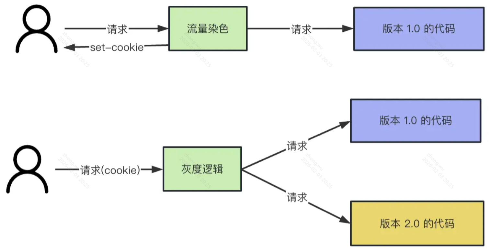

# 上线

## 灰度上线

灰度系统可以把流量划分成多份，一份走新版本代码，一份走老版本代码；而且灰度系统支持设置流量的比例，比如可以把走新版本代码的流程设置为 5%，没啥问题再放到 10%，50%，最后放到 100% 全量。这样可以把出现问题的影响降到最低

nginx 有反向代理的功能，可以转发请求到应用服务器，也叫做网关层。
我们可以在这一层根据 cookie 里的 version 字段来决定转发请求到哪个服务。
在这之前，还需要按照比例来给流量染色，也就是返回不同的 cookie。
不管灰度系统做的有多复杂，底层也就是流量染色、根据标记转发流量这两部分

## CI/CD

是一套自动化流水线，旨在缩短从开发人员提交代码到代码部署上线之间的时间，同时保证质量。

**持续集成CI**

持续集成的核心是自动化构建与测试。

在传统开发模式中，开发人员可能各自工作数周才合并代码，导致合并时冲突频发、问题难以定位。持续集成要求开发人员频繁地（通常每天多次）将代码合并到主干分支。

每次合并触发后，CI 服务器会自动执行以下操作：

- 拉取代码：从仓库获取最新代码
- 编译：验证代码是否能编译通过
- 运行单元测试：检查是否破坏了现有功能
- 代码扫描：检查语法规范、安全漏洞

价值：快速发现集成错误，避免“集成地狱”，确保代码库始终处于可构建的健康状态。

**持续交付CD**

持续交付是在持续集成的基础上，**将经过验证的代码自动部署到类生产环境（如预发布、测试环境），确保随时可以手动部署到生产环境**。
它强调“**一键发布**”——通过自动化将构建产物部署到测试环境，并运行更全面的测试（如集成测试、UI 测试），确保代码不仅能跑起来，而且功能正确。

**持续部署CD**
持续部署是持续交付的下一步，即代码通过所有测试后，自动部署到生产环境，无需人工干预。这是 CI/CD 的终极自动化形态，合并代码后几分钟内，改动即可上线生效.

**典型的 CI/CD 流水线**
一个完整的流水线通常包含以下阶段：

- 代码提交：开发者 git push 代码
- 触发构建：Jenkins、GitHub Actions 等工具检测到变更
- 单元测试：检查代码逻辑正确性
- 代码扫描：SonarQube 等工具检查质量门禁
- 构建打包：生成 Docker 镜像或 jar/war 包
- 部署到测试环境：自动部署供 QA 测试
- 集成/端到端测试：模拟真实用户操作
- 制品管理：将通过的镜像推送到 Harbor 或 Nexus
- 部署到生产：如果是持续部署则自动完成；持续交付则需手动触发

**常见工具**

- CI/CD 平台：Jenkins（老牌，插件生态丰富）、GitLab CI/CD（与代码库集成度高）、GitHub Actions（原生集成，灵活）、CircleCI、Travis CI
- 构建工具：Maven、Gradle（Java）、Webpack（前端）
- 代码质量：SonarQube
- 制品库：Nexus、Harbor（Docker 镜像）、JFrog
- 部署编排：Kubernetes（配合 Helm）、Ansible、Terraform