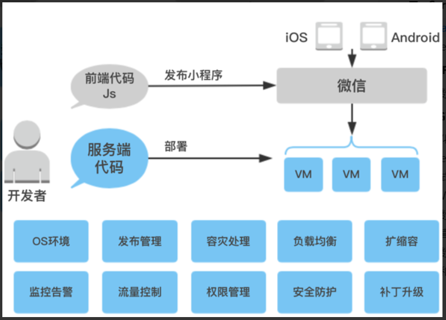
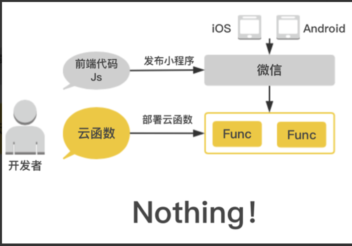
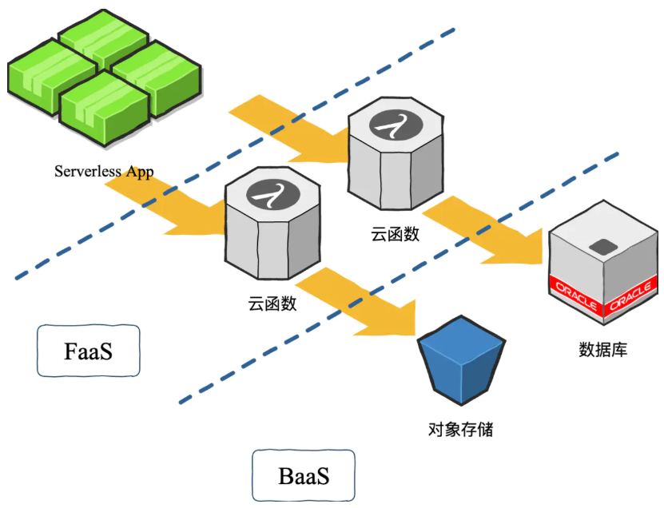

# ServerLess

> 微服务部署，渲染

[Serverless SSR 技术内幕](https://juejin.im/post/5dce7140f265da0bf80b5246?utm_source=gold_browser_extension)

## 背景

**Serverless 云函数**: 云计算发展过程中出现的一种计算资源的抽象，它以云计算平台为基础，为开发者提供业务程序的运行环境，开发者无需关注底层资源分配、扩容部署，代码执行所必要的全部服务由平台提供。
**SSR 服务端渲染**: 指在服务端将 HTML 渲染到前端，早期常用 `php jsp` 技术来在服务端生成 HTML，近年来 js 同构化趋势演进下，逐步出现了在服务端上运行前端 js 代码进行渲染的方案，如 `React、Vue` 等主流框架的同构渲染。
若能将 Serverless 技术落地到 SSR 业务场景，将会有如下优点

- 云服务资源理论上无限扩容，前端不必考虑业务量对 SSR 机器性能的影响
- 前端同学无需关注 SSR 机器的运维、申请、扩容

## 演进

### Serverless 架构下的 App

FaaS 的出现使得服务上云变得容易起来，但是 FaaS 并没有解决 「公共基础服务」 的问题，而所谓公共基础服务，就是形如对象存储、KV存储、消息推送这样的基础服务，这个问题最终落到了云服务提供商这里，因此市面上的云服务无一例外的都提供了上面的「公共基础服务」，这样的服务模式叫做 BaaS（Backend as a Service）。

Serverless 直译过来叫无服务器，这里并不是说不需要服务器，而是说开发者不需要关注服务器，这部分由平台维护提供，开发者仅需关注业务逻辑的开发即可。

