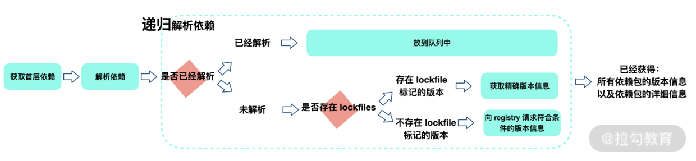
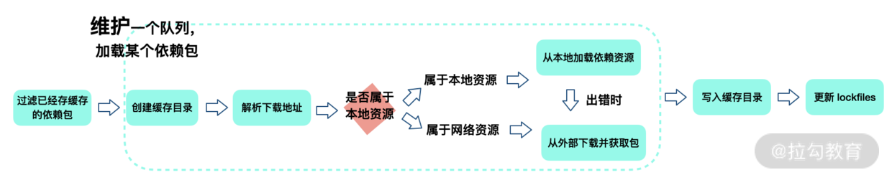
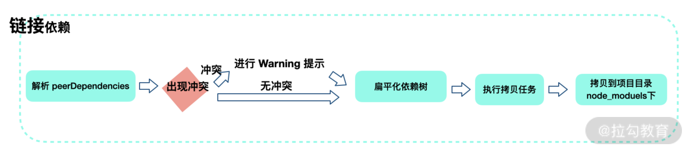

# Yarn

> `Yarn` 是一个由 Facebook、Google、Exponent 和 Tilde 构建的新的 `JavaScript` 包管理器。它的出现是为了解决历史上 `npm` 的某些不足（比如 `npm` 对于依赖的完整性和一致性保障，以及 npm 安装速度过慢的问题等）, 都是为了进一步解放和优化生产力。

相比于npm5之前：

- **确定性**：通过 `yarn.lock` 等机制，保证了确定性。即不管安装顺序如何，相同的依赖关系在任何机器和环境下，都可以以相同的方式被安装。（在 `npm v5` 之前，没有 `package-lock.json` 机制)
- **采用模块扁平安装模式**：将依赖包的不同版本，按照一定策略，归结为单个版本，以避免创建多个副本造成冗余（npm 目前也有相同的优化）
- **网络性能更好**：`Yarn`采用了请求排队的理念，类似并发连接池，能够更好地利用网络资源；同时引入了更好的安装失败时的重试机制
- **采用缓存机制**: 实现了离线模式（npm 目前也有类似实现）。

`Yarn` 另外一个显著区别是 `yarn.lock` 中子**依赖的版本号不是固定版本**。这就说明单独一个 `yarn.lock` 确定不了 `node_modules` 目录结构，还需要和 `package.json` 文件进行配合。

## 缓存

```bash
yarn cache dir
```

`Yarn` 默认使用 `prefer-online` 模式，即优先使用网络数据。如果网络数据请求失败，再去请求缓存数据。

## 安装机制

检测（checking）→ 解析包（Resolving Packages） → 获取包（Fetching Packages）→ 链接包（Linking Packages）→ 构建包（Building Packages）

### 检测包（checking）

这一步主要是检测项目中是否存在一些 npm 相关文件，比如 package-lock.json 等。如果有，会提示用户注意：这些文件的存在可能会导致冲突。在这一步骤中，也会检查系统 OS、CPU 等信息。

### 解析包（Resolving Packages）

首先获取当前项目中 package.json 定义的 dependencies、devDependencies、optionalDependencies 的内容，这属于**首层依赖**。



### 获取包（Fetching Packages）



Yarn 会根据 cacheFolder+slug+node_modules+pkg.name 生成一个 path，判断系统中是否存在该 path，如果存在证明已经有缓存，不用重新下载。这个 path 也就是依赖包缓存的具体路径。

### 链接包（Linking Packages）

**扁平化原则**是核心原则



### 构建包（Building Packages）

如果依赖包中存在二进制包需要进行编译，会在这一步进行
npm 包的安装顺序对于依赖树的影响很大。模块安装顺序可能影响 node_modules 内的文件数量。

## 常用命令

```bash
yarn init

yarn install

yarn add [package]
yarn add [package]@[version]
yarn add [package]@[tag]

yarn add [package] --dev
yarn add [package] --peer
yarn add [package] --optional

yarn upgrade [package]
yarn upgrade [package]@[version]
yarn upgrade [package]@[tag]

yarn remove [package]
```
